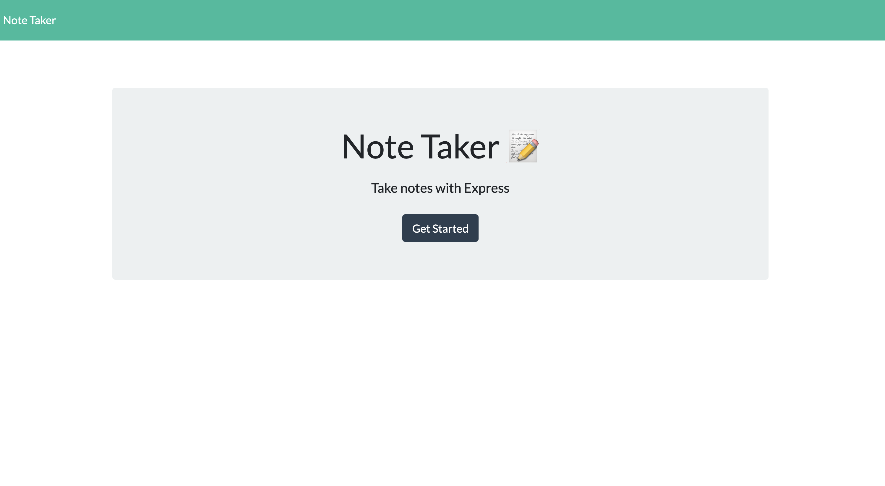
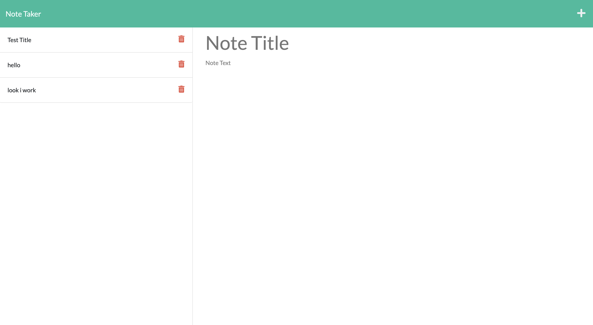
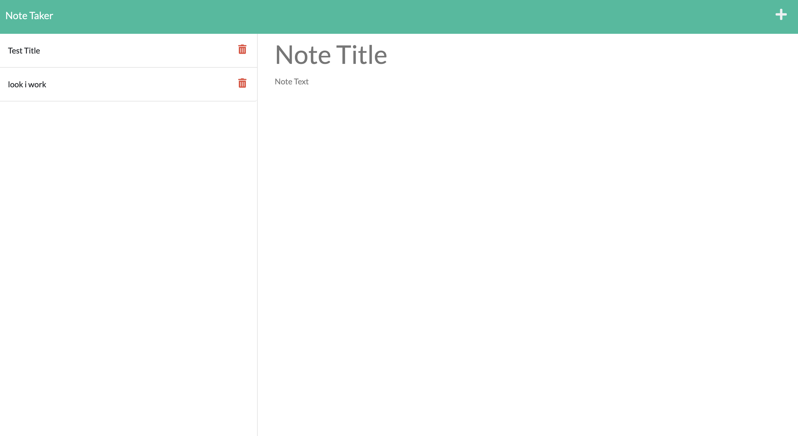

# Note-Taker-Challenege11

## Table of Contents

- [Demo](#Demo)
- [Description](#Description)
- [Installation](#installation)
- [Tests](#tests)
- [Usage](#usage)
- [Links](#Links)
- [Contribution](#contribution)
- [License](#license)
- [Questions](#questions)

# Screenshots

- main page
  
- notes
  
  \*one of the notes being deleted
  

## Description

Build an application that writes and saves notes. This app uses express.js to process all the backend information. For this app I only had to create the backend since the front end was given to me and then connect the two. This app was deployed through Heroku.

## Installation

- Npm install

- view on localhost:3001 or https://notetaker-challenge-11.herokuapp.com/

## Usage

- Press '➕' to add a new note
- Delete previously made notes with the red '🗑'
- View already made notes on the left column of the page

## Links

Github Repository: https://github.com/Ianirwin18/Note-Taker-Challenege11
Deployed Heroku page: https://notetaker-challenge-11.herokuapp.com/

## Contribution

- Myself, Tutors, the Boys

## License

- This repository is licensed under the MIT

## Questions

If you have any questions, please contact me at:

- Email: [Ianirwin18@gmail.com](mailto:Ianirwin18@@gmail.com).
- GitHub: [https://github.com/Ianirwin18](https://github.com/Ianirwin18).
